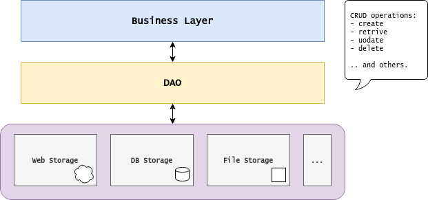

Java Patterns | Data Access Object
===

The **data access object** is an arquitectural design pattern. It proposes a layered arquitecture,
promoting decoupling of classes containing *business logic* from *data access* and corresponding persistence mechanisms:



The generic `DAO<T,K>` *interface* describes CRUD operations for a **data object** of type `T` and unique key of type `K`:

```java
public interface Dao<T, K> {
    T get(K key);
    Collection<T> getAll();
    void save(T instance) throws DaoException;
    void update(T instance) throws DaoException;
    T delete(K key);
    int count();
}
```

## Problem

We wish to have an application that works with a book repository of data.

Our **data object** is of type `Book`. The unique identifier is the book's *ISBN*.

```java
public class Book implements Serializable {

    private final String isbn;
    private String author;
    private String title;
    private int year;

    public Book(String isbn, String author, String title, int year) {
        this.isbn = isbn;
        this.author = author;
        this.title = title;
        this.year = year;
    }

    //...
}
```

Hence, the `BookDao` interface can be as follows:

```java
public interface BookDao extends Dao<Book, String> {

    /* Aditional operations besides CRUD (inherited): */

    Collection<Book> getAllFromAuthorSearch(String queryString);
    Collection<Book> getAllFromYearRange(int yearStart, int yearEnd);
}
```

## Aplication

This project contains a *command-line interface* that allows the user to interact with and underlying repository.

```
Available commands: GET, ADD, DEL, LIST, SEARCH, RANGE, COUNT, QUIT
Type command > search
Author query? wheeler
Book{isbn='Z6X-4Q9-Z1S', author='Thor N. Wheeler', title='eu, ultrices sit amet,', year=2019}

Available commands: GET, ADD, DEL, LIST, SEARCH, RANGE, COUNT, QUIT
Type command > count
Total records: 100
```

The application works only with a `BookDao` *interface*; the underlying repository can be of different types.

There are three implementations provided:

- `BookDaoVolatileList` - its a *volatile* implementation. Data is not persisted across sessions.
- `BookDaoSerialization` - persists data through *java serialization*
- `BookDaoTextFiles` - persists data through text files (one for each existing book)

Run the program and test the different types of repositories. Note that the client code does not need any modifications (it uses only the interface of the dao).

## Exercises

1. Implement the "range" command in the `CLI` method:

    ```java
    ///...
    case "range":
        /* TODO: implement this command */
        System.out.println("[Not implemented]"); 
        break;
    //...
    ```

    - The commands retrives the information from the *dao* using the method:
    `getAllFromYearRange(int yearStart, int yearEnd)`

2. Provide a *concrete BookDAO* implementation based on volatile storage, using an underlying collection of type `Map<String, Book>`.
    - Name it `BookDaoVolatileMap`;
    - The *map key* should correspond to the book's ISBN;
    - This will be similar to `BookDaoVolatileList`, but a little easier to implement.
    - Change the `main` method to use this *concrete dao*. Everything should work as previously.

3. Apply the **Simple Factory** pattern to allow requesting the different available storage strategies.
    - Pattern *participants*:
        - Factory: `BookDaoFactory`
        - Product: `BookDao`
        - Concrete Products: `BookDaoSerialization`, `BookDaoVolatileTextFiles`, `BookDaoVolatileList` and `BookDaoVolatileMap`
        
    - Change the `main` method to use the factory.

4. Provide a *concrete BookDao* implementation that persists data in *JSON* format.
    - Name it `BookDaoJSON`;
    - Download *GSON jar* library (put it in `/lib`) from https://search.maven.org/artifact/com.google.code.gson/gson/2.8.6/jar
    - Similar implementation to `BookDaoSerialization`, but the `saveStorage` and `readStorage` private methods use the *GSON* library;
    - Use the following tutorial:
        - https://futurestud.io/tutorials/gson-mapping-of-arrays-and-lists-of-objects

Solutions can be found [here](SOLUTION.md).